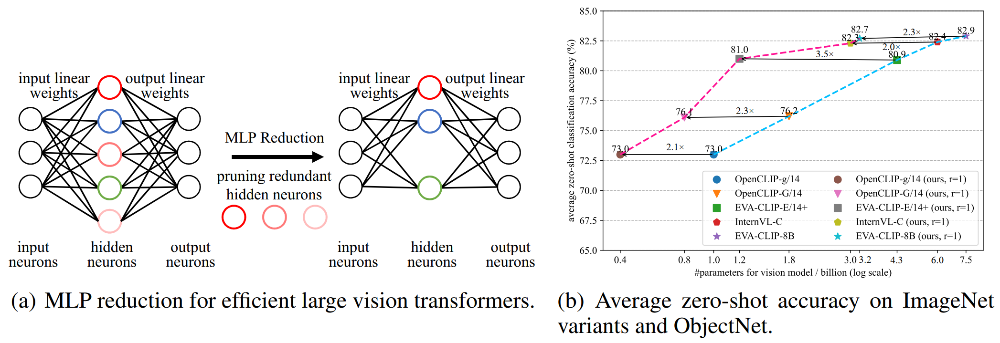

## Diversity-Guided MLP Reduction for Efficient Large Vision Transformers

<div align="center">
  <div align="center">
      <a href="https://pytorch.org/">
        =v2.0.1">
      </a>
      <a>
        
      </a>
      <a>
        
      </a>
      <a>
        
      </a>
      <a>
        
      </a>
      <a>
        
      </a>
    </div>
    <p align="center">
        
    </p>
</div>


[[Paper](https://arxiv.org/abs/2506.08591)]    [[BibTex](#Citation)]   [[HuggingFace](https://huggingface.co/visresearch/DGMR/tree/main)]

Large-scale model parameters lead to an unaffordable cost of computing and memory. We analyze popular transformer architectures and find that multilayer perceptron (MLP) modules take up the majority of model parameters. To this end, we focus on the recoverability of the compressed models and propose a Diversity-Guided MLP Reduction (DGMR) method to significantly reduce the parameters of large vision transformers with only negligible performance degradation. 

### 1. Installation

```bash
conda create -n DGMR python=3.9
conda activate DGMR
pip install -r requirement.txt
```


### 2. Configuration


### 3. MLP Reduction

```bash
python prune.py --prune_method diversity \
      --arch {model_arch} \
      --pretrained {model_path} \
      --mlp_ratio 1 \
      --output_path {output_path}
```


### 4. Distillation

```bash
torchrun \
    --nproc_per_node=8 \
    --master-port=29511 distill.py \
    --config_file /path/to/config \
    --frame eva_clip
```


### 5. Evaluation

+ **Zero-Shot Classification On ImageNet1K**

```bash
NGPU=$(nvidia-smi --query-gpu=name --format=csv,noheader | wc -l)

torchrun --nnodes=1 --nproc_per_node=$NGPU --master-port=29502 \
	eval/clip_eval_zsc_ddp_all.py \
    --model $model \
    --pretrained $ckptpath \
    --batch_size $batch_size \
    --save_clf /path/to/clf \
    --dataset imagenet1k \
    --dataset_root  /path/to/ILSVRC2012
```

**Tips**: At the first evaluation, you are required to pass the `save_clf` parameter, so the text encoding for zero-shot classification will be saved.  For latter evaluation, you can set the `load_clfs` parameter as the previous `save_clf` to skip the running of text encoder.


+ **Zero-Shot Retrieval On COCO**

```bash
python clip/clip_benchmark/cli.py eval \
  --model $model \
  --model_type $model_type \
  --pretrained $ckptpath \
  --language "en" \
  --task "zeroshot_retrieval" \
  --dataset "mscoco_captions" \
  --dataset_root $coco_dataset_path \
  --batch_size $batch_size \
  --output $output_path \
  --num_workers 2
```


+ **Zero-Shot Retrieval On Flickr30k**

```bash
python clip/clip_benchmark/cli.py eval \
  --model $model \
  --model_type $model_type \
  --pretrained $ckpt_path \
  --language "en" \
  --task "zeroshot_retrieval" \
  --dataset "flickr30k" \
  --dataset_root $flickr30k_dataset_path \
  --batch_size $batch_size \
  --output $output_dir \
  --num_workers 2
```


+ **kNN**

```bash
NGPU=$(nvidia-smi --query-gpu=name --format=csv,noheader | wc -l)

torchrun --nnodes=1 --nproc_per_node=$NGPU --master-port=29502 \
	eval/eval_knn.py \
	--frame $frame \
    --config_file $config_file \
    --output_dir $output_dir \
    --batch_size $batch_size \
    --weight $ckpt_path \ 
    --arch $arch
```


### 6. Finetuning Text Encoder

The pruning and distilling is only for vision encoder, it must change the feature map, so we want to finetune the text encoder to let the model run at full health.

```bash
NGPU=$(nvidia-smi --query-gpu=name --format=csv,noheader | wc -l)

torchrun --nnodes=1 --nproc_per_node=$NGPU --master-port=29501 \
	finetune.py \
	--config_file $config_file \
	--frame eva_clip
```


### 7. Model Zoo

+ **Distillation for Vision Encoder**

|     Arch     | weights | zero-shot classification | zero-shot retrival | KNN |
|:------------:|:------------:|:------------------------:|:------------------:|:---:|
|ViT-g-14 (original)  | [Link](https://huggingface.co/laion/CLIP-ViT-g-14-laion2B-s34B-b88K) |  73.0%  | 83.8% | 81.7% |
|**ViT-g-14-prune1 (ours)**  | [Link](https://huggingface.co/visresearch/DGMR/tree/main/ViT-g-14-prune1/distill.pth) |  73.0%  | 83.8% | 81.9% |
|**ViT-g-14-prune2 (ours)**   |[Link](https://huggingface.co/visresearch/DGMR/tree/main/ViT-g-14-prune2/distill.pth) |  73.2%  | 84.1% | 82.1% |
|EVA02-CLIP-bigE-14-plus (original)   |  [Link](https://huggingface.co/QuanSun/EVA-CLIP/blob/main/EVA02_CLIP_E_psz14_plus_s9B.pt) |  80.9% | 85.2% | 85.8% |
|**EVA02-CLIP-bigE-14-plus-prune1 (ours)**   | [Link](https://huggingface.co/visresearch/DGMR/tree/main/EVA02-CLIP-bigE-14-plus-prune1/distill.pth) |  81.0% | 85.2% | 85.7% |
|**EVA02-CLIP-bigE-14-plus-prune2 (ours)**   |[Link](https://huggingface.co/visresearch/DGMR/tree/main/EVA02-CLIP-bigE-14-plus-prune2/distill.pth) |  81.1%  | 85.3% | 85.8% |
|DINO v2 (original) |[Link](https://dl.fbaipublicfiles.com/dinov2/dinov2_vitg14/dinov2_vitg14_pretrain.pth) | / | / | 83.5% |
|**DINO v2 (ours)** |[Link](https://huggingface.co/visresearch/DGMR/tree/main/dinov2/distill.pth) | / | / | 83.5% |


+ **Finetuning Text Encoder**

|     Arch     | weights | zero-shot classification | zero-shot retrival |
|:------------:|:------------:|:------------------------:|:------------------:|
|ViT-g-14 (original)  | [Link](https://huggingface.co/laion/CLIP-ViT-g-14-laion2B-s34B-b88K) |  73.0%  | 83.8% |
|**ViT-g-14-prune1 (ours)**  | [Link](https://huggingface.co/visresearch/DGMR/tree/main/ViT-g-14-prune1/ft.pth) |  73.0%  | 84.0% |
|**ViT-g-14-prune2 (ours)**   |[Link](https://huggingface.co/visresearch/DGMR/tree/main/ViT-g-14-prune1/ft.pth) |  73.1%  | 84.3% |
|EVA02-CLIP-bigE-14-plus (original)   |  [Link](https://huggingface.co/QuanSun/EVA-CLIP/blob/main/EVA02_CLIP_E_psz14_plus_s9B.pt) |  80.9% | 85.2% |
|**EVA02-CLIP-bigE-14-plus-prune1 (ours)**   | [Link](https://huggingface.co/visresearch/DGMR/tree/main/EVA02-CLIP-bigE-14-plus-prune1/ft.pth) |  81.0% | 86.1% |
|**EVA02-CLIP-bigE-14-plus-prune2 (ours)**   |[Link](https://huggingface.co/visresearch/DGMR/tree/main/EVA02-CLIP-bigE-14-plus-prune2/ft.pth) |  81.1%  | 86.3% |


### License

This project is under the CC-BY-NC 4.0 license. See [LICENSE](LICENSE) for details.


### Citation

```bibtex
@article{shen2025diversity,
  author  = {Shen, Chengchao, Zhu, Hourun and Fang, Gongfan and Wang, Jianxin and Wang, Xinchao},
  title   = {Diversity-Guided MLP Reduction for Efficient Large Vision Transformers},
  journal = {arXiv preprint arXiv:2506.07138},
  year    = {2025},
}
```

